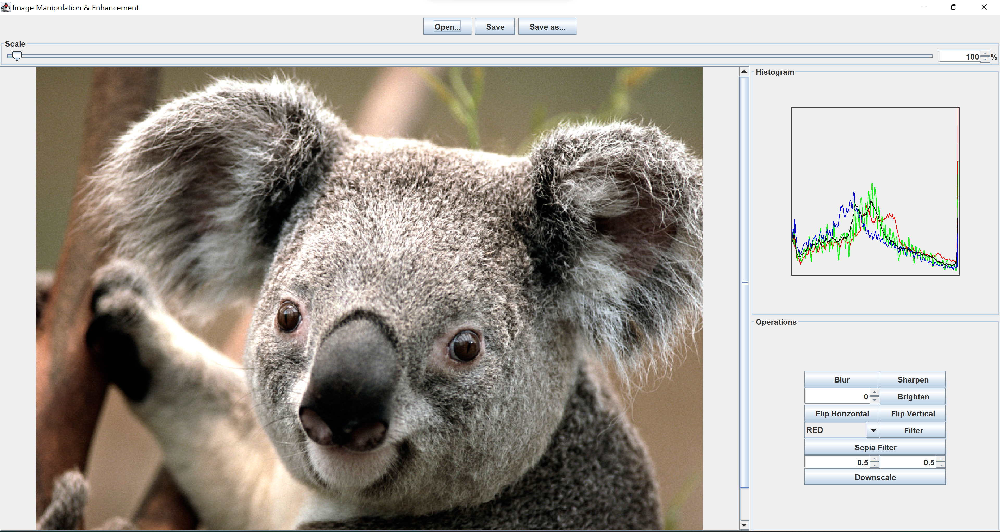

# Image Manipulation and Enhancement

### Application GUI



## Design


`IImage` is the foundational interface for this package. It represents a single image, either
computed or loaded from the file system, and is responsible for the pixel data and metadata of an
image. `StridedImage` is currently the only implementation, and it is based on a simple 3-D float 
array.

The ``IImage`` interface offers you the ability to get a single pixel. IImages in this design
are immutable objects, whose operations are available via `IOperation` which are similar to 
`SpreadSheet` macros. The horizontal and vertical flip operations implement this interface directly.

Operations whose result only depends on the original value, and not the value of other channels or
pixels, are instead implemented under the abstract class `PerPixelChannelOperation` to eliminate 
the need for nested for loops (`Brighten` extends this class). It should be noted that the
`Brighten` operation is also responsible for darkening an image. This is achieved by the user
inputting a negative value for brightening the image.

Operations that involve adjusting individual pixels are implemented under the abstract class 
`PerPixelOperations`. The `Sepia` and `GreyScale` operations extend this class. 

Operations that filter an image are implemented under the abstract class `FilterOperation`. The
`Blur` and `Sharpen` extend this class. It should be noted that these operations make use of the
class `Matrix` which is a data class used to represent a 2-D array of floats. 

Lastly, the `ImageEditor` interface, as well as its only current
implementation, `TextualImageEditor`, allow the user to interact with images in the aforementioned
ways.

## Usage

The `main` method of `TextualImageEditor` is responsible for the console-based application.

### Command List

*This is also a fully-functional script, and it can be used to generate example manipulated images in
the `images` directory.*

```
load images/flower.ppm flower
brighten 0.25 flower flower-brighter
brighten -0.25 flower flower-darker
vertical-flip flower flower-vertical
horizontal-flip flower-vertical flower-vertical-horizontal
red-component flower flower-red
green-component flower flower-green
blue-component flower flower-blue
value-component flower flower-value
luma-component flower flower-luma
intensity-component flower flower-intensity
blur flower flower-blur
sharpen flower flower-sharpen
sepia flower flower-sepia
save images/flower.png flower
save images/flower_brighter.png flower-brighter
save images/flower_darker.png flower-darker
save images/flower_vertical.png flower-vertical
save images/flower_vertical_horizontal.png flower-vertical-horizontal
save images/flower_red.png flower-red
save images/flower_green.png flower-green
save images/flower_blue.png flower-blue
save images/flower_value.png flower-value
save images/flower_luma.png flower-luma
save images/flower_intensity.png flower-intensity
save images/flower_blur.png flower-blur
save images/flower_sharpen.png flower-sharpen
save images/flower_sepia.png flower-sepia
quit
```

